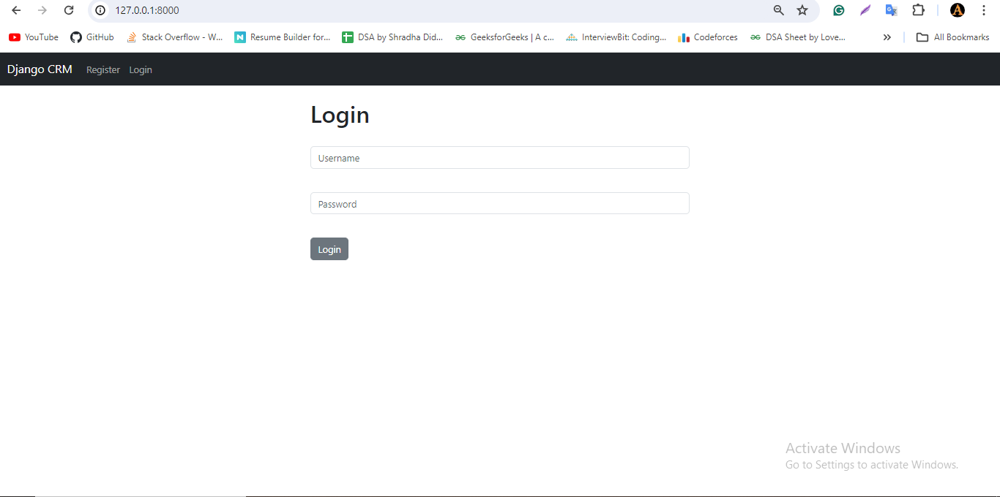
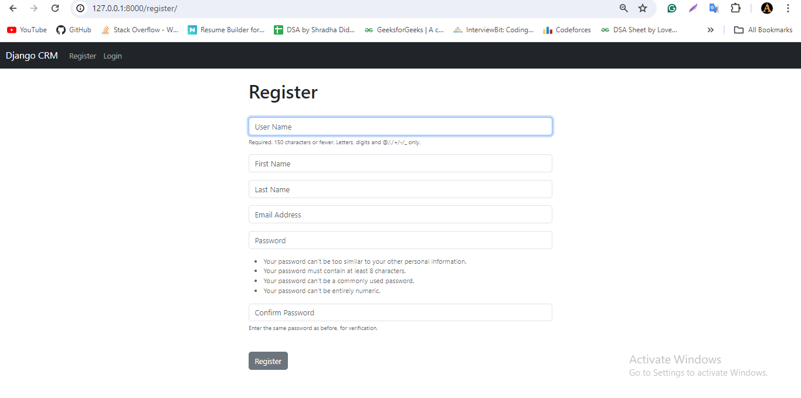
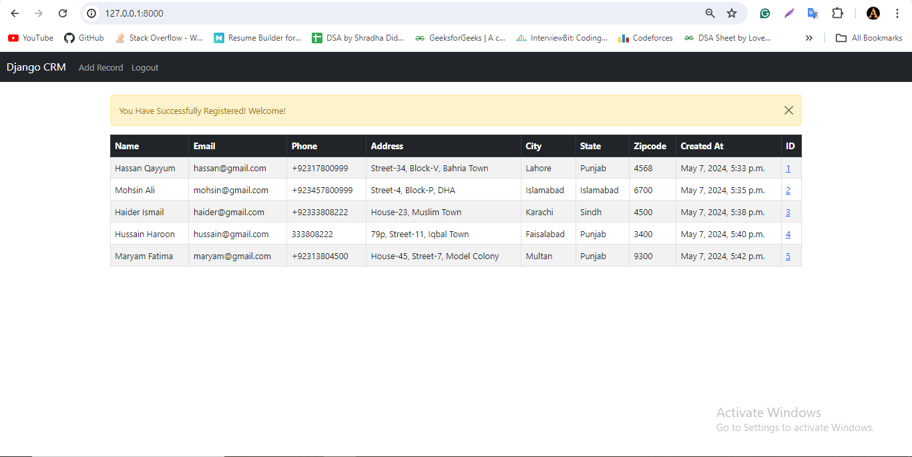
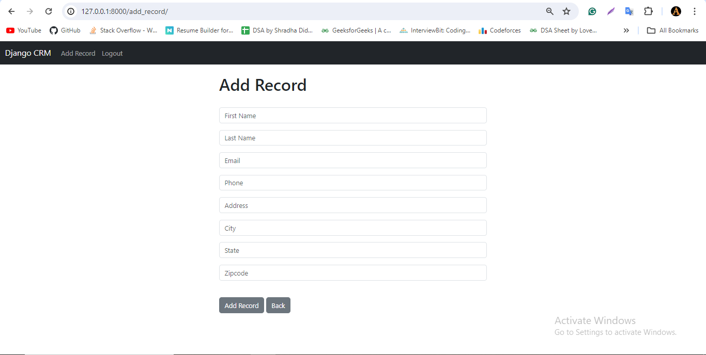
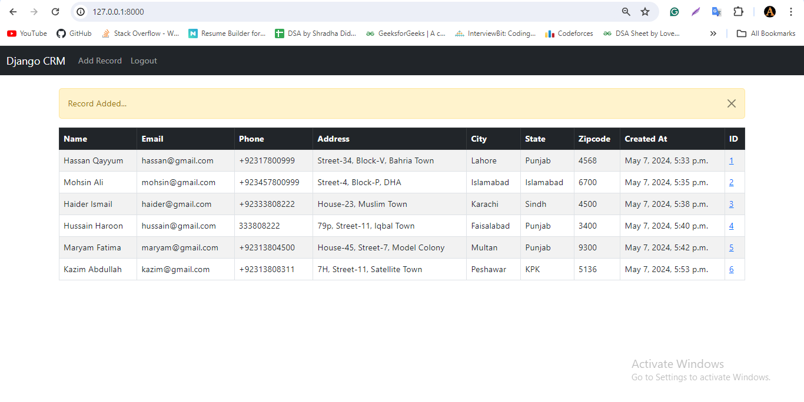
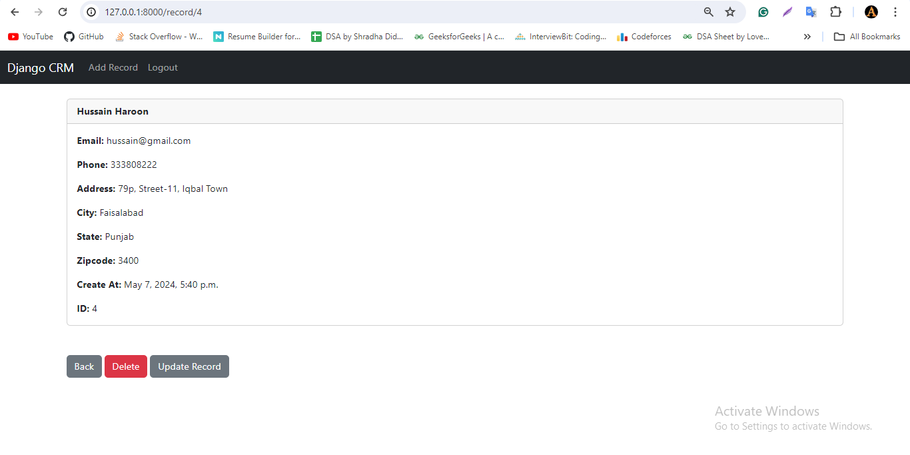
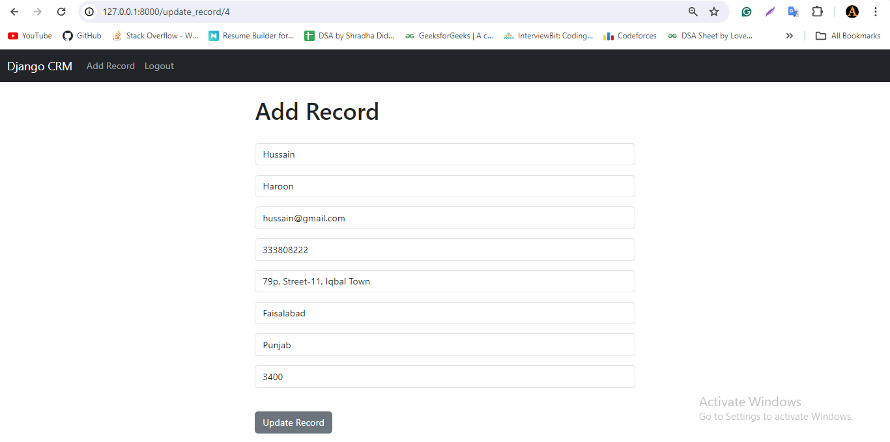
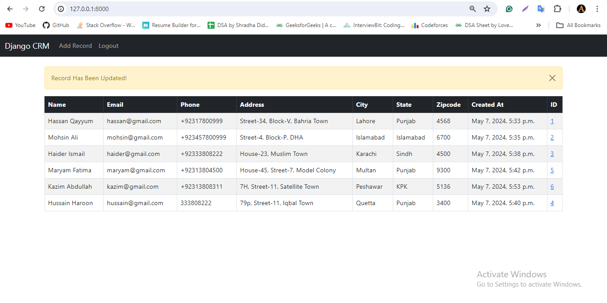
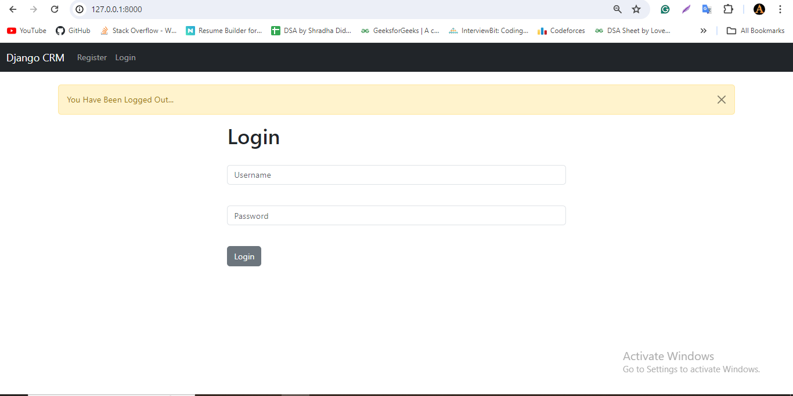

# CRM-app
a CRM(customer relationship manager) web app that let users store, update and delete the customer data. 

<br>

To run this locally, run these commands:
```html
git clone https://github.com/aqeeladil/marketplace.git
```

```html
cd CRM-app
```

```html
pip install django
```

```html
pip install psycopg2
```
<be>

Now run this command below and open http://127.0.0.1:8000/ in your browser to view this project

```html
python3 manage.py runserver
```
<br><br>
**Here is a quick image display for the whole application**


<br>

<br>

<br>

<br>

<br>

<br>

<br>

<br>

<br><br>


        